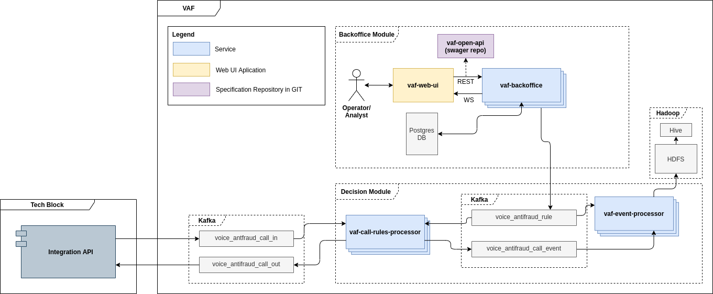

# Voice Antifraud System

## Описание системы
Учебный проект курса [Otus](https://otus.ru) [Microservice Architecture](https://otus.ru/lessons/microservice-architecture/)

Voice Antifraud System - это платформа для антифрод операторов и аналитиков телекоммуникационных компаний.

Задача платформы - предоставить рабочее место аналитика для создания/редактирования и удаления правил проверки сигнального трафика звонков и реагирования системы на звонки определённые как фродовые. Выполняет функции сбора статистики по звонкам и выявленным инцидентам и отправку данной информации в централизованную ИС Антифрод

## Пользовательский сценарий
Оператор антифрод системы на основании аналитических данных через backoffice платформы создаёт новые, актуализирует текущие или удаляет правила обработки звонков.
Платформа на основании таких правил принимает решение о пропуске или блокировки звонка на этапе инициализации. События об обработки звонков сохраняются в аналитическое хранилище для последующего построения витрин и проведения анализа корректности срабатывания правила

## Схема взаимодействия сервисов

## Описание сервисов
* **vaf-backoffice** Сервис по созданию, редактированию и удалению правил обработки звонков. Отвечает за получение информации от оператора, валидации на корректность и сохранении в БД, с последующей отправкой события в kafka voice_antifraud_rule о данном изменении.
* **vaf-call-rules-processor** Сервис обработки звонков согласно правилам. Получает информацию из kafka voice_antifraud_rule о событиях связанных с правилами и обновляет их у себя, получает информации о событии инициации звонка с топика voice_antifraud_call_in, применяет правила к звонку, выдает ответ о для коммутатора в voice_antifraud_call_out, сохраняет информацию об обработки события звонка и принятии решения в voice_antifraud_call_event
* **vaf-event-processor** Сервис по обработки и сохранению информации о действия с правилами voice_antifraud_rule и сработки правил voice_antifraud_call_event. Занимается чтением событий из kafka, очисткой и обогащением событий дополнительной информацией и сохранением в аналитическое хранилище

## Контракты взаимодействия
* **REST API for backoffice** [specs-rule-v1.yaml](specs%2Fspecs-rule-v1.yaml)
* **kafka topic voice_antifraud_rule** [topic-rule.proto](proto%2Ftopic-rule.proto)
* **kafka topic voice_antifraud_call_in** [topic-call-in.proto](proto%2Ftopic-call-in.proto)
* **kafka topic voice_antifraud_call_out** [topic-call-out.proto](proto%2Ftopic-call-out.proto)
* **kafka topic voice_antifraud_call_event** [topic-call-event.proto](proto%2Ftopic-call-event.proto)
